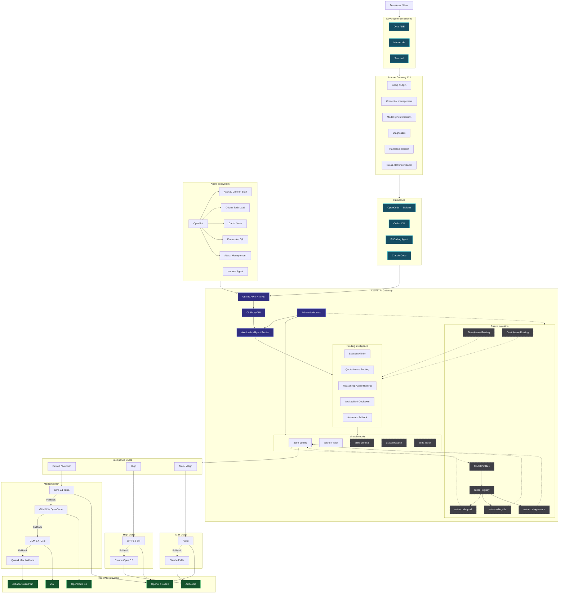
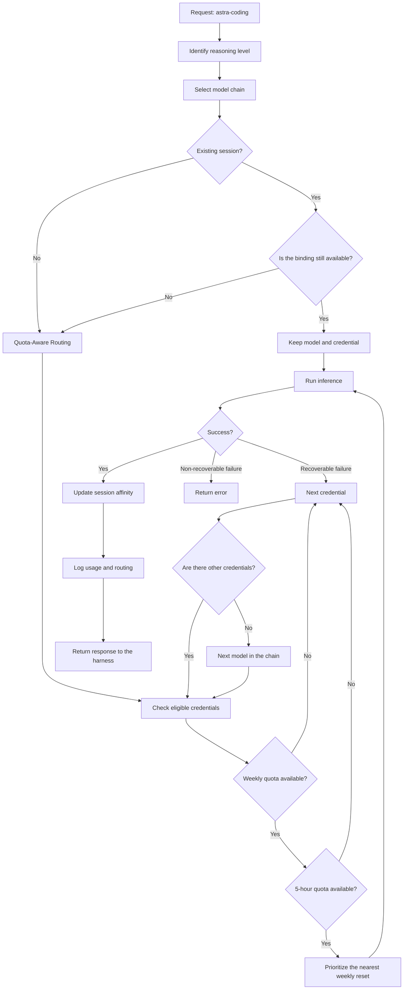

# Axurion AI Ecosystem

```mermaid
flowchart TD
    USER["Developer / User"]

    subgraph INTERFACES["Development interfaces"]
        ORCA["Orca ADE"]
        MONO["Monocode"]
        TERM["Terminal"]
    end

    USER --> INTERFACES

    subgraph CLI["Axurion Gateway CLI"]
        SETUP["Setup / Login"]
        AUTH["Credential management"]
        SYNC["Model synchronization"]
        DOCTOR["Diagnostics"]
        DEFAULT["Harness selection"]
        INSTALL["Cross-platform installer"]
    end

    INTERFACES --> CLI

    subgraph HARNESSES["Harnesses"]
        OC["OpenCode — Default"]
        CX["Codex CLI"]
        PI["Pi Coding Agent"]
        CC["Claude Code"]
    end

    CLI --> HARNESSES

    subgraph AGENTS["Agent ecosystem"]
        OB["OpenBot"]
        HM["Hermes Agent"]
        AS["Asuna / Chief of Staff"]
        OR["Orion / Tech Lead"]
        DEV["Dante / Alan"]
        QA["Fernando / QA"]
        AT["Atlas / Management"]
        OB --> AS & OR & DEV & QA & AT
    end

    HARNESSES --> API
    AGENTS --> API

    subgraph GATEWAY["Axurion AI Gateway"]
        API["Unified API / HTTPS"]
        CPA["CLIProxyAPI"]
        ROUTER["Axurion Intelligent Router"]

        API --> CPA --> ROUTER

        subgraph INTELLIGENCE["Routing intelligence"]
            SESSION["Session Affinity"]
            QUOTA["Quota-Aware Routing"]
            REASON["Reasoning-Aware Routing"]
            HEALTH["Availability / Cooldown"]
            FALLBACK["Automatic fallback"]
        end

        ROUTER --> INTELLIGENCE

        subgraph VIRTUAL["Virtual models"]
            CODING["astra-coding"]
            FLASH["axurion-flash"]
            GENERAL["astra-general"]
            RESEARCH["astra-research"]
            VISION["astra-vision"]
        end

        INTELLIGENCE --> VIRTUAL

        subgraph FUTURE["Future evolution"]
            PROFILE["Model Profiles"]
            SKILLS["Skills Registry"]
            TAIL["astra-coding-tail"]
            TDD["astra-coding-tdd"]
            SECURE["astra-coding-secure"]
            TIME["Time-Aware Routing"]
            COST["Cost-Aware Routing"]

            PROFILE --> SKILLS
            SKILLS --> TAIL & TDD & SECURE
        end

        CODING -.-> PROFILE
        TAIL & TDD & SECURE -.-> CODING
        TIME & COST -.-> INTELLIGENCE

        ADMIN["Admin dashboard"]
        ADMIN --> ROUTER
        ADMIN --> VIRTUAL
        ADMIN -.-> FUTURE
    end

    subgraph LEVELS["Intelligence levels"]
        MED["Default / Medium"]
        HIGH["High"]
        MAX["Max / xHigh"]
    end

    CODING --> LEVELS

    subgraph MEDIUM["Medium chain"]
        TERRA["GPT-6.1 Terra"]
        GLMOC["GLM 5.3 / OpenCode"]
        GLMZ["GLM 5.4 / Z.ai"]
        QWEN["Qwen4 Max / Alibaba"]

        TERRA -->|Fallback| GLMOC
        GLMOC -->|Fallback| GLMZ
        GLMZ -->|Fallback| QWEN
    end

    subgraph ADVANCED["High chain"]
        SOL["GPT-6.2 Sol"]
        OPUS["Claude Opus 5.5"]
        SOL -->|Fallback| OPUS
    end

    subgraph MAXIMUM["Max chain"]
        ASTRA["Astra"]
        FABLE["Claude Fable"]
        ASTRA -->|Fallback| FABLE
    end

    MED --> TERRA
    HIGH --> SOL
    MAX --> ASTRA

    subgraph PROVIDERS["Inference providers"]
        OPENAI["OpenAI / Codex"]
        ANTHROPIC["Anthropic"]
        OPENCODE["OpenCode Go"]
        ZAI["Z.ai"]
        ALIBABA["Alibaba Token Plan"]
    end

    TERRA & SOL & ASTRA --> OPENAI
    OPUS & FABLE --> ANTHROPIC
    GLMOC --> OPENCODE
    GLMZ --> ZAI
    QWEN --> ALIBABA

    classDef gateway fill:#312e81,color:#fff,stroke:#818cf8
    classDef client fill:#164e63,color:#fff,stroke:#22d3ee
    classDef future fill:#3f3f46,color:#fff,stroke:#a1a1aa,stroke-dasharray:5 5
    classDef provider fill:#14532d,color:#fff,stroke:#4ade80

    class API,CPA,ROUTER,ADMIN gateway
    class OC,CX,PI,CC,ORCA,MONO,TERM client
    class PROFILE,SKILLS,TAIL,TDD,SECURE,TIME,COST,GENERAL,RESEARCH,VISION future
    class OPENAI,ANTHROPIC,OPENCODE,ZAI,ALIBABA provider
```

# Heart

```mermaid
flowchart TD
    A["Request: astra-coding"] --> B["Identify reasoning level"]
    B --> C["Select model chain"]
    C --> D{"Existing session?"}

    D -->|Yes| E{"Is the binding still available?"}
    D -->|No| F["Quota-Aware Routing"]

    E -->|Yes| G["Keep model and credential"]
    E -->|No| F

    F --> H["Check eligible credentials"]
    H --> I{"Weekly quota available?"}

    I -->|No| N["Next credential"]
    I -->|Yes| J{"5-hour quota available?"}

    J -->|No| N
    J -->|Yes| K["Prioritize the nearest weekly reset"]

    N --> O{"Are there other credentials?"}
    O -->|Yes| H
    O -->|No| P["Next model in the chain"]
    P --> H

    K --> L["Run inference"]
    G --> L

    L --> M{"Success?"}
    M -->|Yes| Q["Update session affinity"]
    M -->|Recoverable failure| N
    M -->|Non-recoverable failure| R["Return error"]

    Q --> S["Log usage and routing"]
    S --> T["Return response to the harness"]
```