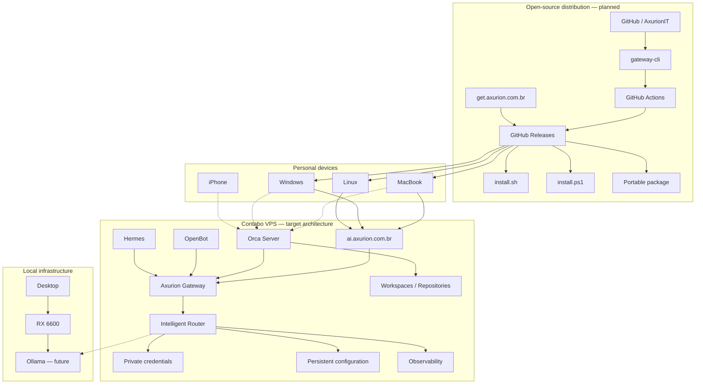

```mermaid
flowchart TD
    subgraph DISTRIBUTION["Open-source distribution — planned"]
        GH["GitHub / AxurionIT"]
        REPO["gateway-cli"]
        CI["GitHub Actions"]
        RELEASE["GitHub Releases"]
        SH["install.sh"]
        PS["install.ps1"]
        BIN["Portable package"]
        DOMAIN["get.axurion.com.br"]

        GH --> REPO --> CI --> RELEASE
        RELEASE --> SH & PS & BIN
        DOMAIN --> RELEASE
    end

    subgraph DEVICES["Personal devices"]
        MAC["MacBook"]
        WIN["Windows"]
        LINUX["Linux"]
        PHONE["iPhone"]
    end

    RELEASE --> MAC & WIN & LINUX

    subgraph CONTABO["Contabo VPS — target architecture"]
        HTTPS["ai.axurion.com.br"]
        GW["Axurion Gateway"]
        IR["Intelligent Router"]
        CRED["Private credentials"]
        CFG["Persistent configuration"]
        LOG["Observability"]
        OS["Orca Server"]
        OB["OpenBot"]
        HM["Hermes"]
        WS["Workspaces / Repositories"]

        HTTPS --> GW --> IR
        IR --> CRED & CFG & LOG
        OS --> WS
        OS & OB & HM --> GW
    end

    MAC & WIN & LINUX --> HTTPS
    MAC & WIN & PHONE -.-> OS

    subgraph LOCAL["Local infrastructure"]
        PC["Desktop"]
        GPU["RX 6600"]
        OLLAMA["Ollama — future"]
        PC --> GPU --> OLLAMA
    end

    IR -.-> OLLAMA
```