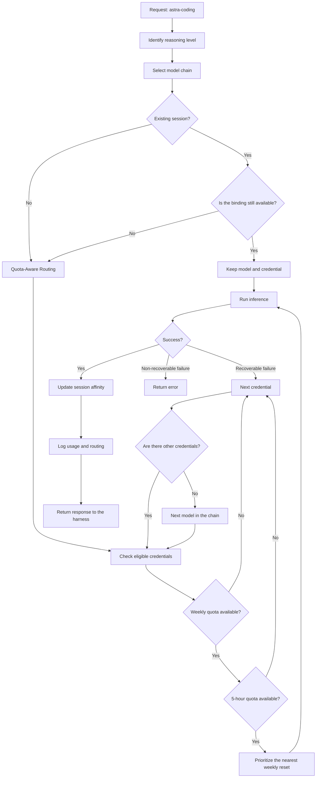

```mermaid
flowchart TD
    A["Request: astra-coding"] --> B["Identify reasoning level"]
    B --> C["Select model chain"]
    C --> D{"Existing session?"}

    D -->|Yes| E{"Is the binding still available?"}
    D -->|No| F["Quota-Aware Routing"]

    E -->|Yes| G["Keep model and credential"]
    E -->|No| F

    F --> H["Check eligible credentials"]
    H --> I{"Weekly quota available?"}

    I -->|No| N["Next credential"]
    I -->|Yes| J{"5-hour quota available?"}

    J -->|No| N
    J -->|Yes| K["Prioritize the nearest weekly reset"]

    N --> O{"Are there other credentials?"}
    O -->|Yes| H
    O -->|No| P["Next model in the chain"]
    P --> H

    K --> L["Run inference"]
    G --> L

    L --> M{"Success?"}
    M -->|Yes| Q["Update session affinity"]
    M -->|Recoverable failure| N
    M -->|Non-recoverable failure| R["Return error"]

    Q --> S["Log usage and routing"]
    S --> T["Return response to the harness"]
```